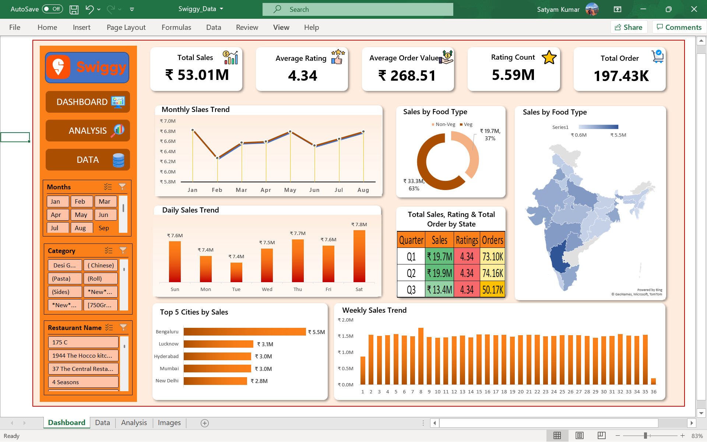

<div align="center">

# 🍔 Swiggy Sales Analysis Dashboard

### Turning 197K+ transaction records into actionable food-delivery insights.

[]()
[]()
[]()
[]()

<br>

### 🚀 [LIVE INTERACTIVE DASHBOARD](https://skbr43.github.io/Swiggy-Sales-Analysis-Dashboard/)

</div>

---

## 📌 Project Overview

The **Swiggy Sales Analysis Dashboard** is an interactive business intelligence project developed using **Microsoft Excel** to analyze food-delivery transaction data.

The project analyzes **197,430 transaction-level records** to understand sales performance, customer ratings, food preferences, geographic performance, and time-based trends.

The objective is to transform raw transactional data into meaningful business insights and present them through an intuitive, interactive dashboard.

A responsive **web version of the dashboard** is also available through GitHub Pages, making the project easy to explore and share across devices.

---

## 🎯 Business Problem

Food-delivery platforms generate large volumes of transactional data. Without structured analysis, it can be difficult to identify important sales patterns and business opportunities.

This project focuses on answering key business questions:

- 📈 How are sales changing over time?
- 📅 Which months, weekdays, and quarters perform best?
- 🗺️ Which cities generate the highest sales?
- 🍽️ What is the sales contribution of Vegetarian vs Non-Vegetarian food?
- ⭐ What is the overall customer rating?
- 💰 What is the average value generated per transaction?
- 📊 Which markets and categories show stronger performance?

---

## 📁 Dataset & Data Source

The raw dataset used for this project was sourced from **Kaggle**.

### 🔗 [Swiggy Restaurant Data - India](https://www.kaggle.com/datasets/nikhilmaurya1324/swiggy-restaurant-data-india)

**Dataset Author:** Nikhil Maurya  
**Platform:** Kaggle  
**Dataset:** Swiggy Restaurant Data - India

The raw data was imported into **Microsoft Excel**, where it was cleaned, validated, transformed, analyzed, and used to create the final dashboard.

| Attribute | Details |
|---|---|
| **Source** | Kaggle |
| **Dataset** | Swiggy Restaurant Data - India |
| **Records Analyzed** | 197,430 |
| **Industry** | Food Delivery / Online Food Ordering |
| **Primary Tool** | Microsoft Excel |
| **Primary Metric** | Sales / Revenue (INR ₹) |
| **Data Granularity** | Transaction-level observations |

### ⚠️ Data Note

The dataset does not contain a unique **Order ID**.

Therefore, the **197,430 dataset records are treated as transaction-level observations** for this analysis.

---

## 📊 Executive KPIs

| KPI | Value |
|---|---:|
| 💰 **Total Sales** | ₹53,012,505.77 |
| 🛒 **Total Transactions** | 197,430 |
| 💵 **Average Order Value** | ₹268.51 |
| ⭐ **Average Rating** | 4.34 / 5.0 |
| 💬 **Rating Count** | 5,591,574 |

These KPIs provide a high-level view of overall sales performance and customer-rating activity.

---

## 🔍 Key Business Insights

### 1. 📈 Strong Overall Sales Performance

The analyzed dataset generated approximately **₹5.30 Crore in total sales**, representing the overall sales value across the available transaction records.

### 2. 📅 Q2 Shows the Strongest Quarterly Performance

Among the displayed quarters, **Q2 records the highest sales**, making it an important period for understanding demand patterns and promotional opportunities.

### 3. 🗺️ Bengaluru Leads the Top City Rankings

**Bengaluru** is the highest-performing city among the top cities analyzed by sales.

Other major markets in the top-city analysis include:

- Lucknow
- Hyderabad
- Mumbai
- New Delhi

### 4. 🍽️ Vegetarian Food Has a Larger Sales Contribution

The dashboard indicates that **Vegetarian food contributes a larger share of sales than Non-Vegetarian food**.

This highlights an opportunity to further investigate vegetarian category demand and restaurant assortment.

### 5. ⭐ Strong Customer Rating

The dataset records an **average rating of 4.34/5**, indicating a strong overall customer-rating signal.

---

## 💡 Business Recommendations

Based on the observed dashboard trends:

### 📍 Focus on High-Performing Markets

High-sales cities such as Bengaluru can be prioritized for:

- Restaurant partnerships
- Customer-retention initiatives
- Localized promotional campaigns
- Delivery-capacity planning

### 🍽️ Strengthen Vegetarian Offerings

Given the larger contribution from Vegetarian sales, restaurant partners could explore:

- Expanding vegetarian menu options
- Creating vegetarian combo meals
- Category-specific promotions
- Premium vegetarian offerings

### 📅 Optimize Promotional Timing

Monthly, weekly, and quarterly sales trends can help identify stronger demand periods and support better planning of:

- Promotional campaigns
- Push notifications
- Discounts
- Restaurant promotions

### 🤝 Strengthen Restaurant Partnerships

High-performing markets can be prioritized for restaurant acquisition and partner-retention strategies to support continued sales growth.

---

## 🛠️ Tools & Technical Skills

### Microsoft Excel

- Data Cleaning
- Data Validation
- Formula-based Feature Engineering
- Pivot Tables
- Pivot Charts
- Slicers
- KPI Calculations
- Conditional Formatting
- Dashboard Design
- Business Analysis

### Analytical Techniques

- Data Aggregation
- Trend Analysis
- Time-based Analysis
- Geographic Analysis
- Category Analysis
- Comparative Analysis
- KPI Development
- Business Insight Generation

---

## 📊 Dashboard Features

The Excel dashboard provides an interactive view of:

- 🎯 KPI Cards
- 📈 Monthly Sales Performance
- 📅 Quarterly Sales Analysis
- 📊 Daily / Weekly Sales Analysis
- 🍽️ Food Type Analysis
- 🗺️ Geographic Sales Analysis
- 🏙️ Top Cities by Sales
- ⭐ Customer Rating Analysis
- 🎛️ Interactive Slicers
- 🔎 Dynamic Filtering

---

## 🖥️ Dashboard Preview

<div align="center">



<br><br>

<i>Swiggy Sales Analysis Dashboard developed in Microsoft Excel.</i>

</div>

---

## 🌐 Live Interactive Dashboard

To make the project easier to explore and share, a responsive web version of the dashboard is hosted using **GitHub Pages**.

### 🚀 [Open Live Dashboard](https://skbr43.github.io/Swiggy-Sales-Analysis-Dashboard/)

The web version presents the major dashboard metrics, sales trends, food analysis, geographic performance, and business insights in an interactive format.

---

## 📁 Repository Structure

```text
Swiggy-Sales-Analysis-Dashboard/
│
├── 📊 Swiggy_Data.xlsx
├── 🖼️ DASHBOARD.png
├── 🌐 index.html
├── 🎨 style.css
├── ⚙️ script.js
└── 📖 README.md
```

### File Description

| File | Purpose |
|---|---|
| `Swiggy_Data.xlsx` | Excel analysis, calculations, Pivot Tables, and dashboard |
| `DASHBOARD.png` | Dashboard preview image |
| `index.html` | Web dashboard structure |
| `style.css` | Web dashboard styling |
| `script.js` | Web dashboard interactions and charts |
| `README.md` | Project documentation |

---

## 🔄 Project Workflow

```text
Raw Kaggle Dataset
        ↓
Data Import into Excel
        ↓
Data Cleaning & Validation
        ↓
Feature Engineering
        ↓
Pivot Tables & Aggregation
        ↓
KPI Calculation
        ↓
Charts & Visualizations
        ↓
Interactive Excel Dashboard
        ↓
Responsive Web Dashboard
        ↓
GitHub Pages Deployment
```

---

## 📚 Learning Outcomes

Through this project, I strengthened my ability to:

- Work with large transactional datasets
- Clean and validate raw data
- Create calculated metrics
- Perform time-based analysis
- Analyze geographic and category-level performance
- Build Excel Pivot Tables and Pivot Charts
- Design interactive dashboards using Slicers
- Develop KPI-driven business analysis
- Convert analytical findings into business recommendations
- Present data insights in a portfolio-ready format
- Publish a dashboard using GitHub Pages

---

## 🚀 Future Improvements

Potential future enhancements include:

- [ ] Build a Power BI version
- [ ] Add Year-over-Year analysis
- [ ] Add restaurant-level performance analysis
- [ ] Add customer segmentation
- [ ] Analyze repeat-customer behavior
- [ ] Add profitability metrics
- [ ] Automate dashboard refresh
- [ ] Connect the dashboard to a live data source
- [ ] Add more advanced web-dashboard filtering

---

## 🙏 Data Attribution

This project uses the **Swiggy Restaurant Data - India** dataset available on Kaggle.

### Original Dataset

🔗 [Kaggle — Swiggy Restaurant Data - India](https://www.kaggle.com/datasets/nikhilmaurya1324/swiggy-restaurant-data-india)

**Dataset Author:** Nikhil Maurya

The dataset was used as the source for this portfolio analysis. All data cleaning, transformations, calculations, visualizations, dashboard development, and business insights presented in this project were performed as part of my analysis using Microsoft Excel.

---

## 👨‍💻 Author

### **Satyam Kumar**

**Aspiring Data Analyst**

📊 Excel • SQL • Python • Data Visualization • Business Analytics

---

<div align="center">

### ⭐ If you found this project useful, consider giving the repository a star!

### 🚀 [Explore the Live Dashboard](https://skbr43.github.io/Swiggy-Sales-Analysis-Dashboard/)

</div>
